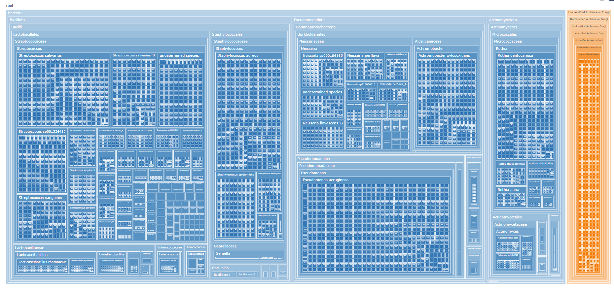

# PROTECT Taxonomy Treemap Viewer

## What it is

The PROTECT Taxonomy Treemap Viewer is an interactive treemap visualization tool for exploring the hierarchical taxonomy distribution of PROTECT isolate collections. It provides a visual representation of taxonomic relationships, enabling researchers to understand the composition and diversity of isolate collections through an intuitive, drill-down interface.

## What it shows (and does not show)

- **Shows:** Hierarchical taxonomy distribution (Domain → Phylum → Class → Order → Family → Genus → Species → Individual isolates) with proportional area representation and interactive drill-down/zoom behavior that allows exploration from high-level taxonomic groups down to individual isolate tiles
- **Does NOT:**
  - Allow editing or modifications to the dataset
  - Expose raw file contents or clinical data
  - Provide data downloads through the treemap interface (data is available separately via related TSV endpoints)

## Where to access it

- **Treemap Viewer:** https://protect.qb3.berkeley.edu/asma/api/taxonomy/treemap
- **Related Table Viewer:** https://protect.qb3.berkeley.edu/asma/api/taxonomy/table

## Data source and ownership

The canonical taxonomy dataset is **maintained by Alex Styer**. The ASMA backend serves the published dataset through taxonomy endpoints, ensuring the treemap visualization reflects the most current taxonomic classifications available.

## How it works (high level)

- **Backend endpoint** serves taxonomy data for visualization through the ASMA FastAPI platform
- **Treemap rendering** displays hierarchical distribution with proportional area representation and supports drill-down exploration of taxonomic levels

## Integration with ASMA Prototype

The Taxonomy Treemap Viewer is linked from the ASMA Prototype "tools" menu, enabling quick access to taxonomy exploration alongside other PROTECT data visualization tools.

## Example treemap snapshot

Below is an example view of the Taxonomy Treemap Viewer interface. Each rectangle represents an individual isolate, and clicking tiles enables drill-down exploration across taxonomic levels from high-level groups down to individual isolates.

## Related documentation

- **[Isolate Table Viewer](../isolate-table-viewer/README.md)** — Interactive table view of the same taxonomy data
- **[ASMA Prototype Platform](../../platforms/asma-prototype/README.md)** — Overview of the ASMA Prototype platform that hosts this viewer

## Current status

The Taxonomy Treemap Viewer is in **initial / iterative** deployment as part of the ASMA platform. The visualization continues to be refined based on user feedback and taxonomy data updates.
